# 🚀 Hey there! I'm Mohsin Sabir

<div align="center">
  
</div>

<div align="center">
  
  
</div>

---

## 🌟 About Me

```typescript
const mohsinSabir = {
    pronouns: "He/Him",
    location: "🌍 Somewhere awesome",
    currentFocus: ["AI/ML", "Text Processing", "Full Stack Development"],
    funFact: "I turn text into magic ✨",
    motto: "Code with passion, create with purpose"
};
```

<div align="center">
  
</div>

---

## 🎯 Featured Projects

<div align="left">

### 🖼️ Text to Image Generator
> **Transform your words into stunning visuals!** This powerful tool converts text descriptions into beautiful images using advanced AI models. Perfect for content creators, designers, and anyone who wants to bring their imagination to life.

**✨ Key Features:**
- 🎨 Multiple art styles and formats
- ⚡ Lightning-fast generation
- 🖥️ User-friendly interface
- 📱 Mobile responsive design

</div>

---

<div align="left">

### 📝 Text Summarization Engine

> **Distill lengthy content into concise insights!** An intelligent summarization tool that extracts key information from large texts, making content consumption faster and more efficient.

**🔥 Key Features:**
- 🧠 Advanced NLP algorithms
- 📊 Customizable summary length
- 🌐 Multi-language support
- 📈 Accuracy metrics

</div>

---

<div align="left">

### 🏛️ English to Roman Converter

> **Bridge ancient and modern worlds!** Convert English numerals to Roman numerals with precision and style. Perfect for historical documents, educational content, and classical design projects.

**⚡ Key Features:**
- 🔢 Accurate conversion algorithms
- 🎯 Input validation and error handling
- 🎨 Beautiful, intuitive interface
- 📚 Educational mode with explanations

</div>

---

## 🛠️ Tech Stack

<div align="center">

### Languages


### Frameworks & Libraries


### Tools & Platforms


</div>

---

## 📊 GitHub Analytics

<div align="center">
  
</div>

<div align="center">
  
</div>

---

## 🌱 Current Learning Journey

```mermaid
graph LR
    A[🤖 Advanced AI/ML] --> B[🧠 Deep Learning]
    A --> C[🔮 Computer Vision]
    B --> D[📝 NLP Enhancement]
    C --> E[🎨 Generative AI]
    D --> F[🚀 Production Deployment]
    E --> F
```



---

## 🤝 Let's Connect!

<div align="center">

[](www.linkedin.com/in/mohsin-sabir-1a46a82b7)
[](https://mohsin-sabir-portfolio.vercel.app/)
[](mailto:sabirmohsin65@gmail.com)

</div>

---

## 💭 Philosophy

<div align="center">
  
</div>

---

## 🎯 Fun Facts

- 🔥 I've converted over **10,000** text descriptions into images
- 📚 My summarization engine has processed **millions** of words
- 🏛️ Roman numeral converter has helped **thousands** learn ancient numbering
- ☕ I debug with coffee and solve problems with curiosity
- 🌟 Always excited to collaborate on innovative projects!

---

<div align="center">
  
</div>

<div align="center">
  <i>⭐ Don't forget to star my repositories if you find them useful!</i>
</div>
